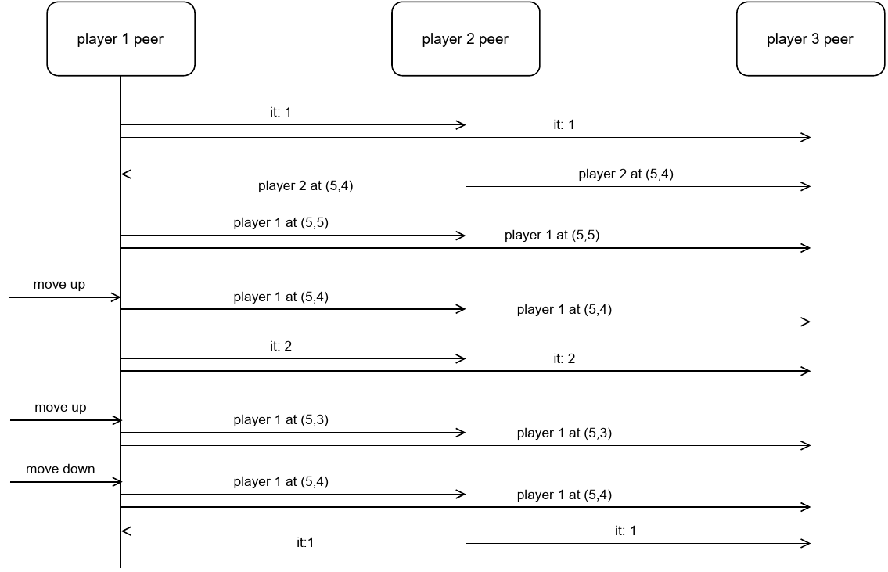

# PureScript web-based P2P multiplayer game

This project is intended to be a template for creating simple PureScript web-based real-time multiplayer games.  The game is deliberately very simple: In a game of Tig, each player controls a character on a grid. "It" chases the others to "tig" them.

Players' browser instances communicate using broadcast messages via a web-socket broadcast server.  (A simple broadcast server is provided.)

## Set-up

  1. Copy file ```ws-broadcast.js``` to a server reachable by all players and start it using node.js:

    > npm install ws
    > node ws-broadcast.js

  2. Install PureScript tools (if needed):

    > npm install -g purescript@0.13.8
    > npm install -g spago

  3. Build index.js:

    > spago bundle-app

  4. Each player opens the provided HTML file tigGame.html in a browser and play.

## How it works inside

Some aspects of the inner working of the game are described here using [UML sequence diagrams](https://www.uml-diagrams.org/sequence-diagrams.html).

### A peer connecting and then joining and leaving a game


### Lobby and root Halogen component interactions


### Player 1 catching player 2 and getting caught again

All messages among peers shown here as direct messages are in fact broadcast via a web-socket broadcasting server.


